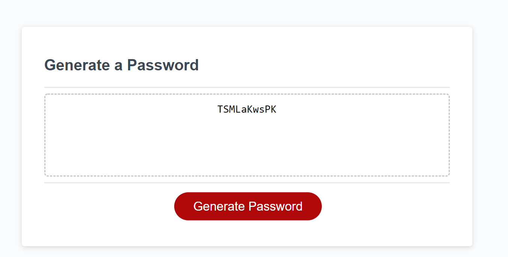

# Password Generator Code
This website is a password generator. It uses Javascript to create prompt questions so the user can choose if they want upper case, lower case, special characters, and numbers in their password. Once criteria is selected in the prompt pop ups. The webpage generates a password between 8 - 128 characters. 

# Code Used:

 CSS 
 

 HTML 
 

 Javascript 
 

# Screenshot 

# Links 
https://lynchk07.github.io/PasswordGenerator/

# Github 
https://github.com/Lynchk07/PasswordGenerator